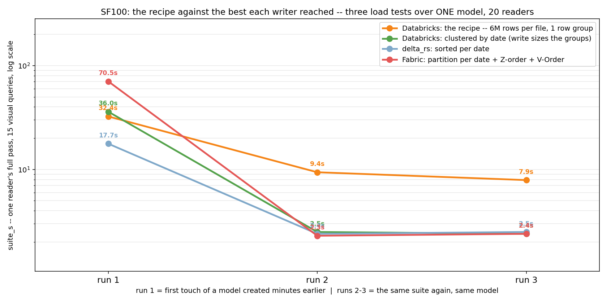
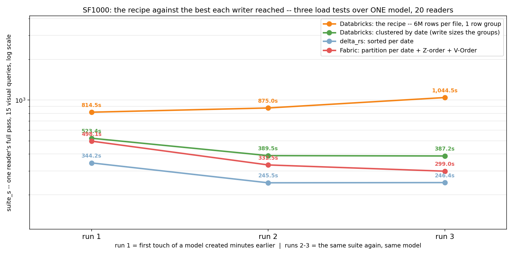

# What layout does VertiPaq prefer?

VertiPaq reads parquet from any producer; Direct Lake is not a compatibility gate and V-Order is not
a ticket of entry. The engine has a *preference*, a layout it transcodes fast and holds small:
dictionary encoding on every column the data allows, and row groups of a few million rows. Both are
cluster configuration, the same lines for every table. One optional step per fact table, `CLUSTER BY` on the column the reports
filter, does the rest. Everything here was measured on TPC-DS SF100 and SF1000 under Microsoft's
own Direct Lake benchmark protocol.





The recipe against the best each other writer reached, three load tests back to back over one
model, 20 readers, log scale: run 1 pays the transcode, runs 2 and 3 are the resident model. How to
read them, the cold-run confound and the geometry behind every bar: [LEARNING.md](LEARNING.md),
*The result, both scale factors*, and [summary.csv](summary.csv).

## ⚠️ I am not a Spark expert

**I know the parquet and VertiPaq side of this well enough. I am not a Spark expert, and Spark on
Databricks is a large system with many interacting settings, so where this repo gets Spark wrong
the error is mine, not the platform's. Corrections are welcome.**

## The cluster config

The same lines on every cluster that writes these tables.

```
spark.sql.files.maxRecordsPerFile                                      6000000     # default 0 = no limit
spark.hadoop.parquet.block.size                                        2147483648  # default 134217728 (128 MB)
spark.databricks.delta.optimizeWrite.enabled                           true        # default false
spark.databricks.delta.optimizeWrite.binSize                           4096        # default 512 (MiB of shuffle per task)

spark.hadoop.parquet.page.row.count.limit                              16000000    # default 20000
spark.hadoop.parquet.page.size                                         67108864    # default 1048576 (1 MB)
spark.hadoop.parquet.dictionary.page.size                              67108864    # default 1048576 (1 MB)
spark.hadoop.parquet.enable.dictionary                                 true        # default true

spark.databricks.delta.properties.defaults.checkpointPolicy            classic     # default v2 once CLUSTER BY is declared
spark.databricks.delta.properties.defaults.autoOptimize.optimizeWrite  true        # default unset
spark.databricks.delta.properties.defaults.autoOptimize.autoCompact    false       # default unset
```

- **Photon off.** Photon's writer ignores the `parquet.*` keys: `runtime_engine: STANDARD` on the
  cluster that writes these tables.
- **Latest runtime.** Everything here was measured on DBR 19 (parquet-java 1.17). Older runtimes
  accept parquet keys they do not implement and ignore them silently.
- **Predictive optimization off**, per schema: `ALTER SCHEMA <catalog>.<schema> DISABLE PREDICTIVE
  OPTIMIZATION`. Anything that rewrites the files from compute without this config undoes the layout.

What each line does, what the block was measured to deliver, and what it cannot do:
[LEARNING.md](LEARNING.md), *The config* and *The config in prose*.

## Per table, optional: `CLUSTER BY` the column the reports filter

Everything above applies to every table the same way. An ordering names a column, so it is a
decision per table, and it is only worth making on a fact whose reports filter on one column, on a
star schema usually the date key. Dimensions get a plain `saveAsTable`. On Databricks the ordering
reaches the files through `CLUSTER BY` on one key, declared before the first append:

```python
fq  = "catalog.schema.store_sales"
key = "ss_sold_date_sk"          # the ONE column the reports filter on

df.limit(0).write.format("delta").saveAsTable(fq)                                    # empty table, schema only
spark.sql(f"ALTER TABLE {fq} SET TBLPROPERTIES ('delta.checkpointPolicy' = 'classic')")
spark.sql(f"ALTER TABLE {fq} CLUSTER BY ({key})")
df.write.format("delta").mode("append").saveAsTable(fq)                              # the write, unchanged
```

What it buys at SF100, 20 readers, steady state:

| SF100, 20 users | rows per row group | suite | p50 | p95 | worst query |
|---|---|---|---|---|---|
| Databricks, the config, nothing else | 5.6-5.9M | 7.9 s | 207 ms | 2.8 s | 8.3 s |
| Databricks, the config + `CLUSTER BY` date | 1.1-2.0M | **2.5 s** | 124 ms | 0.35 s | 0.71 s |
| Fabric Spark, V-Order + partition by date (the paper's layout) | 78k-144k | 2.4 s | 119 ms | 0.37 s | 0.80 s |

What breaks it, each measured on DBR 19; the numbers are in [LEARNING.md](LEARNING.md), *What NOT
to do, if you want CLUSTER BY to work*:

- **One key**, the filter column. Two keys become a Hilbert curve, which orders no single column.
- **`checkpointPolicy = classic` before the key exists.** Direct Lake cannot read a v2 checkpoint.
- **No `df.orderBy(key)` before the write.** Optimized Writes deletes the sort; `CLUSTER BY` is how
  an ordering reaches a Delta file on this write path.
- **No `OPTIMIZE` from compute without the config.** Predictive optimization and SQL warehouses are
  that compute.
- **Clustering on write is size-gated and silent when it skips.** Verify per file, min and max of
  the key, never from the metadata.

## References

- **[Modern Power BI Architecture Choices for Reporting on Azure Databricks](https://raw.githubusercontent.com/microsoft/FabricCAT/main/Direct%20Lake_DirectQuery/Modern%20Power%20BI%20Architecture%20Choices.pdf)**
  (PDF) — Microsoft's white paper, the reference protocol for everything measured here.
- **[lipinght/DB-DQ-Whitepaper](https://github.com/lipinght/DB-DQ-Whitepaper)** — the paper's
  artifacts, MIT, commit `99f9904d`: the 24-query DAX capture, the semantic models and its
  published result CSVs.
- **[Lakehouse: A New Generation of Open Platforms that Unify Data Warehousing and Advanced Analytics](https://www.cidrdb.org/cidr2021/papers/cidr2021_paper17.pdf)**
  (PDF) — the CIDR 2021 paper that defined the term: open formats on object storage that any
  engine, BI tools included, reads directly.
- **[Snowflake Managed Iceberg Tables: Interop Performance](https://www.snowflake.com/en/engineering-blog/managed-iceberg-tables/)**
  — the closest precedent, November 2025: Snowflake writes, Databricks SQL, Spark and Trino read,
  TPC-DS, with file size and partitioning as the knob.
- **[LEARNING.md](LEARNING.md)** — what was measured, what made the config, what is still open.
- **[RUN.md](RUN.md)** — deploy and run, Databricks and Fabric.
- **[direct-lake-parquet-layout](https://github.com/djouallah/direct-lake-parquet-layout)** — the
  companion repo: the same question on Fabric capacity, four writers, capacity units as the metric.
- **[The skill](plugins/vertipaq-delta-layout/skills/vertipaq-delta-layout/SKILL.md)** — the
  recipe for an AI coding assistant, so it applies it as measured instead of reaching for
  `orderBy`, `repartition` or a per-table file size. For Claude Code:
  `/plugin marketplace add djouallah/parquet_layout_vertipaq_spark`, then
  `/plugin install vertipaq-delta-layout@parquet_layout_vertipaq_spark`. Not required to use the
  config.
